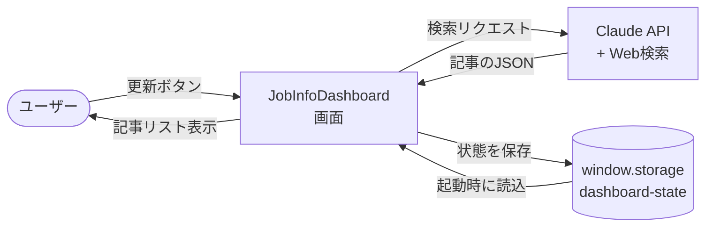
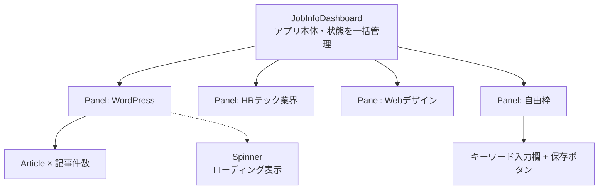
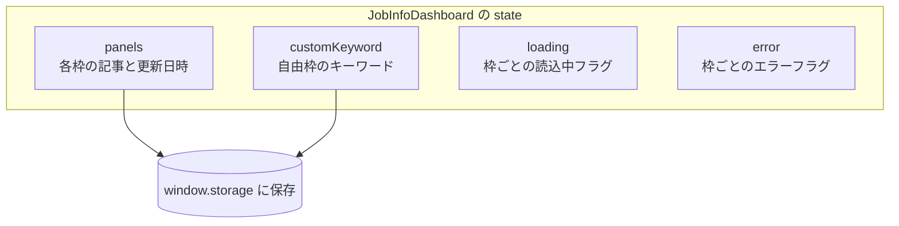
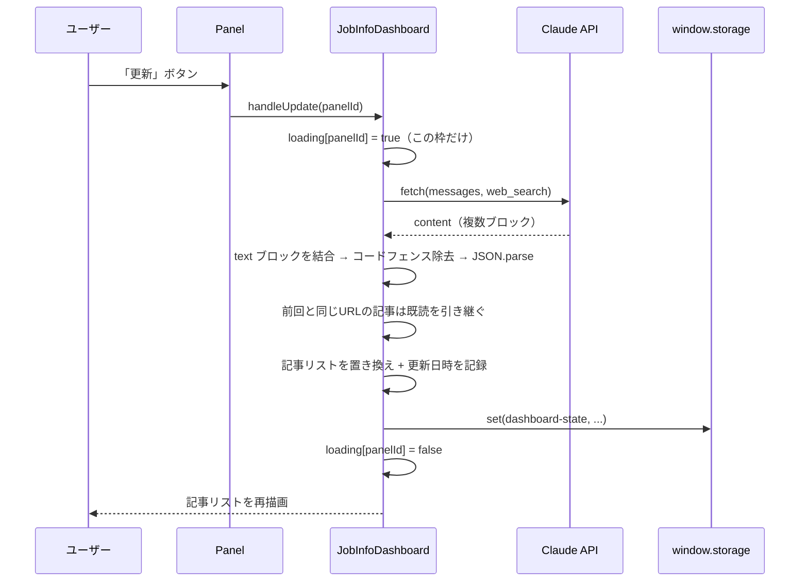

# アーキテクチャ — 仕事情報収集ダッシュボード

`JobInfoDashboard.jsx`（単一ファイルの React コンポーネント）の設計をまとめた資料です。
「どの部品が」「どう繋がって」動くかを、JavaScript 初級者向けに図で示します。

---

## 1. 全体像



- 情報の入手先は **Claude API（Web検索付き）だけ**。RSS や外部サイトへの直接 fetch はしない（CORS で失敗するため）。
- 状態の保存先は **`window.storage` だけ**。localStorage / sessionStorage は使わない（Artifact 環境で動かないため）。

---

## 2. コンポーネント構成

1ファイルの中を、役割ごとの小さな部品に分けています。



| 部品 | 役割 |
|------|------|
| `JobInfoDashboard`（default export） | 全状態を持つ親。API 呼び出し・保存・既読管理をここで行う |
| `Panel` | パネル1枚。ヘッダー・更新ボタン・記事リストを描画 |
| `Article` | 記事1件。タイトル(リンク)・媒体名・要約・既読チェック |
| `Spinner` | 控えめな回転スピナー |
| `PANELS`（定数） | 4枠の定義（名前・検索指示・カラーバー色）をまとめた配列 |

---

## 3. 状態（State）の設計

親コンポーネントだけが状態を持ち、子（Panel / Article）は props で受け取って表示するだけ、という一方向の流れです。



- **`panels` と `customKeyword`** … 永続化する（保存して次回も使う）。
- **`loading` と `error`** … 一時的な表示状態なので保存しない。**枠ごとに独立**しているため、1枠が更新中でも他の枠は操作できる。

---

## 4. 更新フロー（更新ボタンを押したとき）



**エラー時の分岐**

- API 失敗・JSON パース失敗 → `try/catch` で受け、その枠に「取得に失敗しました。もう一度お試しください」を表示。**前回の記事は消さない**。
- `items` が空配列 → 「新しい情報が見つかりませんでした」を表示。
- どちらもアプリ全体は落とさない（1枠のエラーが他枠に波及しない）。

---

## 5. データ取得の内部処理

```mermaid
flowchart LR
  Prompt[buildPrompt<br/>検索指示を埋め込む] --> Fetch[fetch<br/>Claude API]
  Fetch --> Filter["content から<br/>type==='text' だけ結合"]
  Filter --> Clean["```json / ``` を除去"]
  Clean --> Parse[JSON.parse]
  Parse --> Items["items 配列<br/>[{title, summary, url, source}]"]
```

- レスポンスの `data.content` は**複数ブロックの配列**。text ブロックだけを取り出して結合する（順番に依存しない）。
- 返ってきたテキストにコードフェンスが混ざっていても `JSON.parse` できるよう、先に除去する。

---

## 6. 永続化（window.storage）の設計

**キーは `dashboard-state` の1つだけ。** 全状態をこの1キーにまとめて保存する（パネルごとに分けない＝レート制限対策）。

```jsonc
{
  "panels": {
    "wordpress": {
      "updatedAt": "2026-07-06T14:30:00.000Z",
      "items": [
        { "title": "...", "summary": "...", "url": "...", "source": "...", "read": false }
      ]
    },
    "hrtech":  { "updatedAt": "...", "items": [ ... ] },
    "design":  { "updatedAt": "...", "items": [ ... ] },
    "custom":  { "updatedAt": "...", "items": [ ... ] }
  },
  "customKeyword": "設定したキーワード"
}
```

**読み書きのタイミング**

| いつ | 何をする |
|------|----------|
| 起動時（`useEffect`） | `storage.get` で読込。初回はキーが無く**エラーを投げる**ので `try/catch` で初期状態にフォールバック |
| 更新成功時 | 記事リストと更新日時を保存 |
| 既読チェック切替時 | 即座に保存 |
| キーワード保存時 | キーワードを保存 |

> `window.storage` のメソッドはすべて `await` が必要で、第3引数 `shared` は常に `false` を明示する。

---

## 7. 画面レイアウト

```
┌──────────────── max-w-5xl ────────────────┐
│  ヘッダー（タイトル・説明）                 │
│  ┌────────────┐  ┌────────────┐            │
│  │ WordPress  │  │ HRテック   │  デスクトップ：
│  └────────────┘  └────────────┘   2×2 グリッド
│  ┌────────────┐  ┌────────────┐            │
│  │ Webデザイン│  │ 自由枠     │            │
│  └────────────┘  └────────────┘            │
└────────────────────────────────────────────┘
```

- モバイル（`md` 未満）は 1 カラム縦積み（`grid-cols-1 md:grid-cols-2`）。
- 各パネル左端の細いカラーバー1本で色分け（青 / 緑 / 紫 / アンバー）。それ以外の装飾色は使わない。
- コンセプトは「静かな作業机」：薄いウォームグレー背景・白いカード・最小限の影。

---

## 8. 設計上の約束（Artifact 環境の制約）

- 単一ファイルの React コンポーネント（default export・必須 props なし）。
- スタイルは Tailwind のコアユーティリティのみ（任意値 `[...]` は使わない）。
- `localStorage` / `sessionStorage` / `<form>` タグは使わない。入力は `onChange`、ボタンは `onClick` で処理する。
- 外部への直接 fetch は Claude API のみ。API キーは環境側で処理されるため渡さない。
